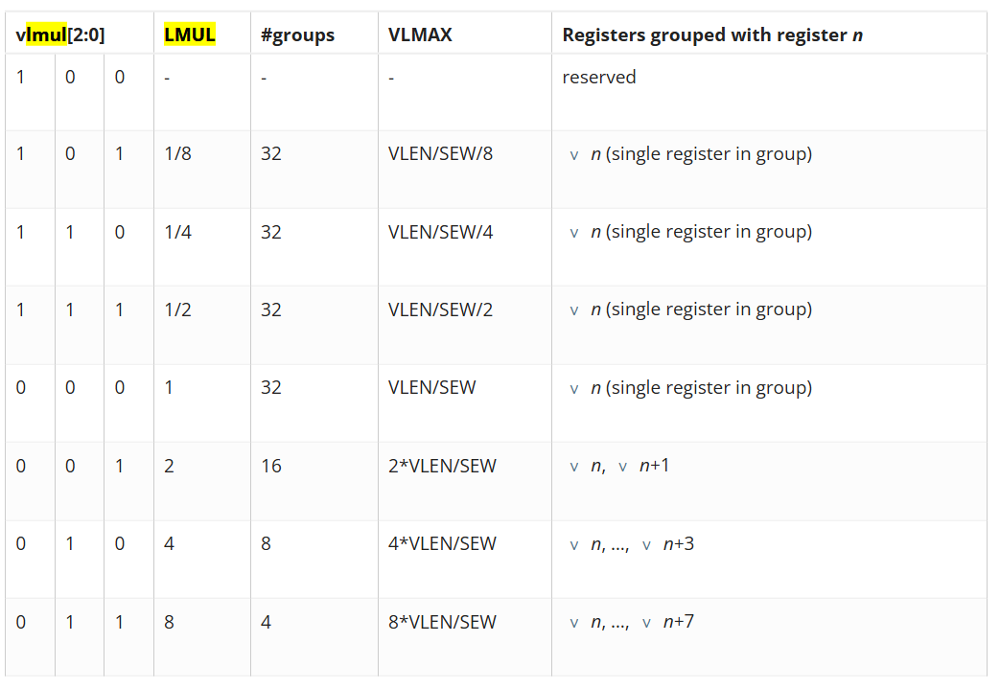
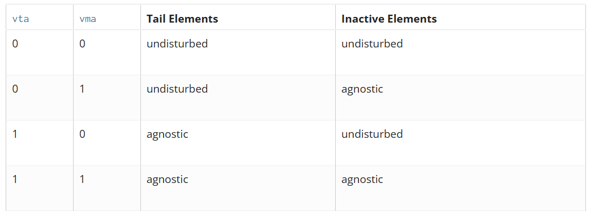
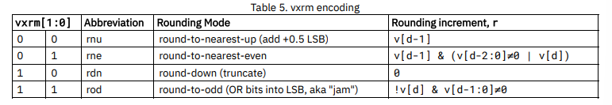

# Notes quotidiennes

## 09/05/2025

### Verilog

```Verilog
// Module called "dff" has 3 inputs and 1 output port
module dff (input d,
            input clk,
            input rstn,
            output reg q);

    // Contents of the module
    always @ (posedge clk) begin
        if (!rstn)
            q <= 0;
        else
            q <= d;
    end
endmodule

// used to implement shift register
module shift_reg (  input d,
                    input clk,
                    input rstn,
                    output q);

    wire [2:0] q_net;
    dff u0 (.d(d),          .clk(clk), .rstn(rstn), .q(q_net[0]));
    dff u1 (.d(q_net[0]),   .clk(clk), .rstn(rstn), .q(q_net[1]));
    dff u2 (.d(q_net[1]),   .clk(clk), .rstn(rstn), .q(q_net[2]));
    dff u3 (.d(q_net[2]),   .clk(clk), .rstn(rstn), .q(q));

endmodule
```

#### Déclaration de ports

Par défaut `wire` : connection directe entre deux éléments, assignation continue
On peut aussi spécifier `reg` qui permet d'enregistrer la valeur. Valable uniquement pour des ports de sortie (`output`) et utilisable seulement dans des blocks procéduraux `always` et `initial`.

#### Opérateurs

- `assign` : affectation **immédiate** d'une variable de type `wire`, peut contenir une expression dépendant de plusieurs signaux. Ne convient pas à la MAJ d'une variable de type `reg`.
- `+`, `-`, `*`, `/`, `%`, `**`
- `<`, `>`, `<=`, `>=`
- `===` (eq incluant `X` et `Z`), `!==` (neq incluant `X` et `Z`), `==` (eq résultat p-e inconnu), `!=` (neq résultat p-e inconnu),
- `&&`, `&`, `||`, `|`, `!` convertit une valeur !=0 en valeur =0 et vice-versa
- `<<` (lsl), `<<<` asl, `>>` (rsl), `>>>` (asr)
- concaténation : `{elem1[1:0], elem2, ..., elemN};`
- réplication : `assign res = {7{a}};` (7 ne peut pas être une variable, ne pas utiliser pour les signaux `output` / `inout`);

#### `always` blocks

```Verilog
always @ (event)
    [statement]

always @ (event) begin
    [multiple statements]
end
```

### Implémentation du PICO-RV32

> Les 32 registres sont stockés dans la variable `cpuregs`, au même titre que les registres gérant les `IRQs`.

### RVV

#### ISA

<https://storage.googleapis.com/shodan-public-artifacts/RVV-Specification-Docs/riscv-v-spec-1.0-frozen-for-public-review.pdf>

#### Paramètres

- `ELEN >= 8` : puissance de 2, la taille max des éléments des vecteurs
- `VLEN >= ELEN` : puissance de 2 ($\le 2^{16} = 64$ Kib), la taille des vecteurs

#### Registres

- 32 registres vectoriels (`v0` - `v31`) de longueurs fixes `VLEN`.
- 7 "unprivileged" CSRs :

|Adress|Privilege|Name|Description|
|---|---|---|---|
|0x008|URW|`vstart`|Vector start position|
|0x009|URW|`vxsat`|Fixed-Point Saturate Flag|
|0x00A|URW|`vxrm`|Fixed-Point Rounding Mode|
|0x00F|URW|`vcsr`|Vector control and status register|
|0x020|URO|`vl`|Vector length|
|0x021|URO|`vtype`|Vector data type register|
|0x022|URO|`vlenb`|`VLEN/8` (vector register length in bytes)|

`mstatus` register :


Signification du champ `VS` dans le registre `mstatus` :

- `0` : **OFF**, pas implémenté, erreur si tentative d'utilisation
- `1` : **INITIAL**, implémenté, pas d'opération vectorielle réalisée depuis le dernier reset
- `2` : **CLEAN**, implémenté, l'unité vectorielle a été init ou restaurée, pas d'opération vectorielle depuis
- `3` : **DIRTY**, implémenté, l'état de l'unité vectorielle a subit des modifications depuis le dernier reset / restauration

L'exécution d'une instruction vectorielle changeant l'état (incluant les `CSRs`) depuis `mstatus.VS = INITIAL | CLEAN` fait passer `mstatus.VS` à `DIRTY`, et donc `mstatus.SD = 1`, sinon la valeur qui va bien. (`mstatus.SD` indique si une des unités vectorielle/flottante/XS est `DIRTY`)

## 12/05/2025

### RVV

#### Registre `vtype`

Sur `XLEN = 32` bits, lecture seule, décrit comment doit être interprété le contenu des registres vecteurs et comment doit être traité les valeurs débordantes.

- `(XLEN-1)` : `vill`, à 1 indique que la configuration demandée n'est pas supportée
- `(XLEN-2 : 8)` : `0`, reservé si différent de 0
- `(7)` : `vma`, *vector mask agnostic*
- `(6)` : `vta`, *vector tail agnostic*
- `(5 : 3)` : `vsew(2:0)`, largeur des éléments (*SEW = selected element width*). (`0b000=8`, `0b001=16`, `0b010=32`, `0b011=64`, `0b1XX=réservé`)
- `(2 : 0)` : `vlmul(2:0)`, nombre de vecteurs à considérer pour cette instruction. Peut être entier ou fractionnaire (toujours puissance de 2)

##### LMUL

La valeur de `VLMAX = LMUL*VLEN/SEW` représente le nombre max d'éléments qui peuvent être opéré par une seule instruction, comme indiqué dans la table suivante :



> Le numéro du registre de base `v` doit être multiple de `LMUL` (pour `LMUL > 1`), sinon c'est invalide

##### VTA / VMA

Les éléments de destination `tail` et `inactive` sont les éléments d'un registre qui ne reçoivent pas de valeur lors d'une instruction



> Quoiqu'il arrive, les éléments masqués de la *queue* sont toujours traîtés comme *agnostique*, indépendamment de la valeur de `vta`.

> `undisturbed` : la valeur contenue dans les éléments concernés ne change pas

> `agnostic` : soit la valeur contenue dans les éléments concernés est conservée (comme `undistrubed`), soit elle est remplacée par des `1`, avec une combinaison aléatoire et pas nécessairement déterministe

Configuration du registre `vtype` :

```mips
    ta   # Tail agnostic
    tu   # Tail undisturbed
    ma   # Mask agnostic
    mu   # Mask undisturbed

    vsetvli t0, a0, e32, m4, ta, ma   # Tail agnostic, mask agnostic
    vsetvli t0, a0, e32, m4, tu, ma   # Tail undisturbed, mask agnostic
    vsetvli t0, a0, e32, m4, ta, mu   # Tail agnostic, mask undisturbed
    vsetvli t0, a0, e32, m4, tu, mu   # Tail undisturbed, mask undisturbed
```

##### vill

Permet d'encoder que l'appel précédent à `vset{i}vl{i}` a tenté d'écrire une valeur non supportée dans `vtype`. Cela permet de brancher sur le bit de poids fort de `vtype` afin de savoir si on doit lever une exception ou non.

Tous les bits de `vtype` doivent être vérifiés pour définir la valeur de `vill` et déterminer ou non si c'est compatible avec l'architecture plutôt que d'exécuter quelque chose d'erroné.

Si `vill = 1`, toute tentative d'exécution d'instruction dépendant de `vtype` lèvera une `IllegalInstructionException`. Cela ne concerne donc pas les instructions `vset{i}vl{i}` et les lectures/écritures/moves de vecteurs complets.

Si `vill = 1`, tous les autres bits de `vtype` doivent être mis à `0`.

#### Registre `vl` : *Vector Length*

Registre de `XLEN = 32` bits, lecture seule.

Le nombre d'éléments (`unsigned`) à MAJ avec le résultat d'une instruction vectorielle. Ne peut être modifié que par `vset{i}vl{i}` ou des *"fault-only-first vector load instruction variants"*. Ce nombre prend en compte la valeur de `LMUL`, i.e. avec `VLEN=32`, `LMUL=8`, `SEW=8` on a `VL=32` (4 éléments par vecteur, fois 8 vecteurs).

#### Registre `vlenb` : *Vector Byte Length*

Registre de `XLEN = 32` bits, lecture seule. Rien à voir avec `vl` juste au dessus.

Vaut `VLEN/8`. Ca doit être une constante dans le design.

#### Registre `vstart` : *Vector Start Index CSR*

Spécifie l'indice du premier élément à être exécuté par une instruction vectorielle (cf 3.7)

> `vstart` est remis à `0` à la fin de l'exécution de chaque instruction vectorielle, même `vset{i}vl{i}`.

> `vstart` n'est pas modifié par une instruction qui lève une `IllegalInstructionException`

> `vstart` doit avoir suffisamment de bits (pas plus) pour pouvoir indicer tous les éléments avec `LMUL` maximal et `SEW` minimal

> `vstart` ne doit pas contenir de valeur plus grande que l'indice max d'un élément, recommandé de *trap* dans ces cas là

> Normalement, `vstart` est seulement écrit par le matériel. Il peut être écrit par du *unprivileged code* mais c'est peu recommandé pour les applications et peut causer de forts ralentissements sur certaines implémentations. Néanmoins nécessaire pour des libs de *threading* au niveau utilisateur.

> L'implémentation peut lever une `IllegalInstructionException` si la valeur de `vstart` n'est pas obtenable via une exécution à partir de `vstart=0`. Exemple : certaines implémentations n'interrompent pas les instructions vectorielles arithmétiques et traitent les IRQ après. Ainsi, quand l'implémentation exécute une instruction avec `vstart!=0` elle peut lever une exception

#### Registre `vxrm` : *Vector fixed-point rounding mode*

Registre **R/W** de longueur `XLEN` dont les 2 LSB détermine la méthode d'arrondi. Les autres sont mis à `0`. En notant `v` la valeur pré-arrondi et `d` le nombre de bits à arrondir on a :



Les fonctions d'arrondi sont :

```c
roundoff_unsigned(v,d) = (unsigned(v) >> d) + r
roundoff_signed(v,d) = (signed(v) >> d) + r
```

#### Registre `vxsat` : *Vector fixed-point saturation flag*

Registre **R/W** dont le LSB indique si une instruction *fixed-point* a dû saturer une sortie pour rentrer dans le format de destination. Les autres bits doivent être mis à `0`.

Ce bit est cloné dans le registre `vcsr`.

#### Registre `vcsr` : *Vector Control and Status*

Les deux valeurs des registres précédents (`vxrm`, `vxsat`) peuvent aussi être accédées depuis `vcsr`.

- `vcsr(2:1) = vxrm(1:0)`
- `vcsr(0) = vxsat(0)`

#### État de l'extension vectorielle au reset

> `vtype` et `vl` doivent avoir des valeurs qui peuvent être lues et restaurées avec une seule instruction `vsetvl`. Il est recommandé de mettre `vtype.vill = 1` et le reste de `vtype` à 0, `vl` à `0`

> `vstart`, `vxrm`, `vxsat` peuvent prendre des valeurs arbitraires au reset (car `vstart` recquiert quoiqu'il arrive une instruction `vset{i}vl{i}` et (`vxrm`, `vxsat`) doivent être initialisés clairement par le SW)

> Les registres vectoriels peuvent avoir des valeurs arbitraires au reset

### Verilog

#### *Reduction operators*

```Verilog
    wire [3:0] a = 4'b1010;

    wire result_and   = &a;   // 1 & 0 & 1 & 0 = 0
    wire result_or    = |a;   // 1 | 0 | 1 | 0 = 1
    wire result_xor   = ^a;   // 1 ^ 0 ^ 1 ^ 0 = 0
    wire result_nand  = ~&a;  // ~(1 & 0 & 1 & 0) = 1
    wire result_nor   = ~|a;  // ~(1 | 0 | 1 | 0) = 0
    wire result_xnor1 = ~^a;  // ~(1 ^ 0 ^ 1 ^ 0) = 1
    wire result_xnor2 = ^~a;  // Same as above
```

## 13/05/2025

### Implémentation `vadd.vv`

#### Idée générale

```mips
vadd.vv vd, vs2, vs1, vm # vector-vector add
```

```c
for (int i = 0; i < ((VLEN*LMUL)/SEW) - 1; i++) {
    res_17 = vs1[SEW*(i+1) : SEW*i] + vs2[SEW*(i+1) : SEW*i];
    vd[SEW*(i+1) : SEW*i] = res_17[SEW-1 : 0];
}
```

## 14/05

### PicoRV32 - Simulation

Pour générer un fichier `ram.hex` contenant le programme, exécuter `make all` depuis le dossier souhaité dans le répertoire `software` (depuis wsl)

Pour générer un fichier `bootloader.hex`, exécuter `make all` depuis le répertoire `bootloader/bootloader/` (depuis wsl)

Pour lancer la simulation (depuis windows) :

- `cd DE1/sim_work`
- `vlog  +acc -l comp.log -timescale "1ns/1ps" +define+IDEBUG +define+SIMULATION +incdir+../includes -f ../comp_file`
- `vsim -L altera_mf soc_core_tb`

#### Executer de l'assembleur

Mettre les instructions en hexa au début du fichier du bootloader fonctionne. Compiler un fichier `.s` produit un binaire complexe pour rien et fonctionne pas, pourquoi ?