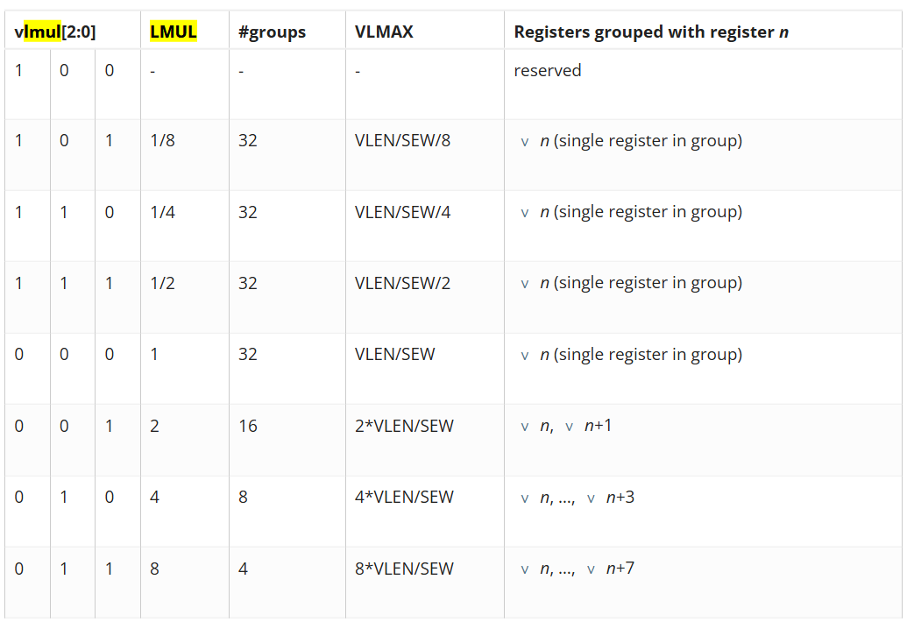
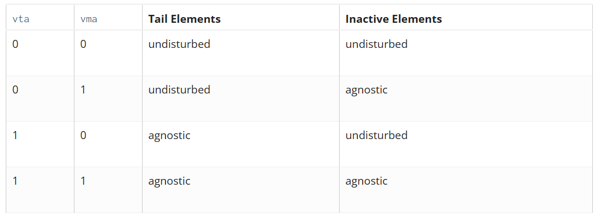

# Notes quotidiennes

## 09/05/2025

### Verilog

```Verilog
// Module called "dff" has 3 inputs and 1 output port
module dff (input d,
            input clk,
            input rstn,
            output reg q);

    // Contents of the module
    always @ (posedge clk) begin
        if (!rstn)
            q <= 0;
        else
            q <= d;
    end
endmodule

// used to implement shift register
module shift_reg (  input d,
                    input clk,
                    input rstn,
                    output q);

    wire [2:0] q_net;
    dff u0 (.d(d),          .clk(clk), .rstn(rstn), .q(q_net[0]));
    dff u1 (.d(q_net[0]),   .clk(clk), .rstn(rstn), .q(q_net[1]));
    dff u2 (.d(q_net[1]),   .clk(clk), .rstn(rstn), .q(q_net[2]));
    dff u3 (.d(q_net[2]),   .clk(clk), .rstn(rstn), .q(q));

endmodule
```

#### Déclaration de ports

Par défaut `wire` : connection directe entre deux éléments, assignation continue
On peut aussi spécifier `reg` qui permet d'enregistrer la valeur. Valable uniquement pour des ports de sortie (`output`) et utilisable seulement dans des blocks procéduraux `always` et `initial`.

#### Opérateurs

- `assign` : affectation **immédiate** d'une variable de type `wire`, peut contenir une expression dépendant de plusieurs signaux. Ne convient pas à la MAJ d'une variable de type `reg`.
- `+`, `-`, `*`, `/`, `%`, `**`
- `<`, `>`, `<=`, `>=`
- `===` (eq incluant `X` et `Z`), `!==` (neq incluant `X` et `Z`), `==` (eq résultat p-e inconnu), `!=` (neq résultat p-e inconnu),
- `&&`, `&`, `||`, `|`, `!` convertit une valeur !=0 en valeur =0 et vice-versa
- `<<` (lsl), `<<<` asl, `>>` (rsl), `>>>` (asr)
- concaténation : `{elem1[1:0], elem2, ..., elemN};`
- réplication : `assign res = {7{a}};` (7 ne peut pas être une variable, ne pas utiliser pour les signaux `output` / `inout`);

#### `always` blocks

```Verilog
always @ (event)
    [statement]

always @ (event) begin
    [multiple statements]
end
```

### Implémentation du PICO-RV32

> Les 32 registres sont stockés dans la variable `cpuregs`, au même titre que les registres gérant les `IRQs`.

### RVV

#### ISA

<https://storage.googleapis.com/shodan-public-artifacts/RVV-Specification-Docs/riscv-v-spec-1.0-frozen-for-public-review.pdf>

#### Paramètres

- `ELEN >= 8` : puissance de 2, la taille max des éléments des vecteurs
- `VLEN >= ELEN` : puissance de 2 ($\le 2^{16} = 64 Kio$), la taille des vecteurs

#### Registres

- 32 registres vectoriels (`v0` - `v31`) de longueurs fixes `VLEN`.
- 7 "unprivileged" CSRs :

|Adress|Privilege|Name|Description|
|---|---|---|---|
|0x008|URW|`vstart`|Vector start position|
|0x009|URW|`vxsat`|Fixed-Point Saturate Flag|
|0x00A|URW|`vxrm`|Fixed-Point Rounding Mode|
|0x00F|URW|`vcsr`|Vector control and status register|
|0x020|URO|`vl`|Vector length|
|0x021|URO|`vtype`|Vector data type register|
|0x022|URO|`vlenb`|`VLEN/8` (vector register length in bytes)|

`mstatus` register :


Signification du champ `VS` dans le registre `mstatus` :

- `0` : **OFF**, pas implémenté, erreur si tentative d'utilisation
- `1` : **INITIAL**, implémenté, pas d'opération vectorielle réalisée depuis le dernier reset
- `2` : **CLEAN**, implémenté, l'unité vectorielle a été init ou restaurée, pas d'opération vectorielle depuis
- `3` : **DIRTY**, implémenté, l'état de l'unité vectorielle a subit des modifications depuis le dernier reset / restauration

L'exécution d'une instruction vectorielle changeant l'état (incluant les `CSRs`) depuis `mstatus.VS = INITIAL | CLEAN` fait passer `mstatus.VS` à `DIRTY`, et donc `mstatus.SD = 1`, sinon la valeur qui va bien. (`mstatus.SD` indique si une des unités vectorielle/flottante/XS)

## 12/05/2025

### RVV

#### Registre `vtype`

Sur `XLEN = 32` bits, décrit comment doit être interprété le contenu des registres vecteurs et comment doit être traité les valeurs débordantes.

- `(XLEN-1)` : `vill`, à 1 indique que la configuration demandée n'est pas supportée
-  `(XLEN-2 : 8)` : `0`, reservé si différent de 0
- `(7)` : `vma`, *vector mask agnostic*
- `(6)` : `vta`, *vector tail agnostic*
- `(5 : 3)` : `vsew(2:0)`, largeur des éléments (*SEW = selected element width*). (`0b000=8`, `0b001=16`, `0b010=32`, `0b011=64`, `0b1XX=réservé`)
- `(2 : 0)` : `vlmul(2:0)`, nombre de vecteurs à considérer pour cette instruction. Peut être entier ou fractionnaire (toujours puissance de 2)

##### LMUL

La valeur de `VLMAX = LMUL*VLEN/SEW` représente le nombre max d'éléments qui peuvent être opéré par une seule instruction, comme indiqué dans la table suivante :



> Le numéro du registre de base `v` doit être multiple de `LMUL` (pour `LMUL > 1`), sinon c'est invalide

##### VTA / VMA

Les éléments de destination `tail` et `inactive` sont les éléments d'un registre qui ne reçoivent pas de valeur lors d'une instruction 



> Quoiqu'il arrive, les éléments masqués de la *queue* sont toujours traîtés comme *agnostique*, indépendamment de la valeur de `vta`.

> `undisturbed` : la valeur contenue dans les éléments concernés ne change pas

> `agnostic` : soit la valeur contenue dans les éléments concernés est conservée (comme `undistrubed`), soit elle est remplacée par des `1`, avec une combinaison aléatoire et pas nécessairement déterministe

Configuration du registre `vtype` :

```mips
    ta   # Tail agnostic
    tu   # Tail undisturbed
    ma   # Mask agnostic
    mu   # Mask undisturbed

    vsetvli t0, a0, e32, m4, ta, ma   # Tail agnostic, mask agnostic
    vsetvli t0, a0, e32, m4, tu, ma   # Tail undisturbed, mask agnostic
    vsetvli t0, a0, e32, m4, ta, mu   # Tail agnostic, mask undisturbed
    vsetvli t0, a0, e32, m4, tu, mu   # Tail undisturbed, mask undisturbed
```

##### vill

Permet d'encoder que l'appel précédent à `vset{i}vl{i}` a tenté d'écrire une valeur non supportée dans `vtype`. Cela permet de brancher sur le bit de poids fort de `vtype` afin de savoir si on doit lever une exception ou non.

Tous les bits de `vtype` doivent être vérifiés pour définir la valeur de `vill` et déterminer ou non si c'est compatible avec l'architecture plutôt que d'exécuter quelque chose d'erroné.

Si `vill = 1`, toute tentative d'exécution d'instruction dépendant de `vtype` lèvera une `IllegalInstructionException`. Cela ne concerne donc pas les instructions `vset{i}vl{i}` et les lectures/écritures/moves de vecteurs complets.

Si `vill = 1`, tous les autres bits de `vtype` doivent être mis à `0`.

#### Registre `vl` : *Vector Length*